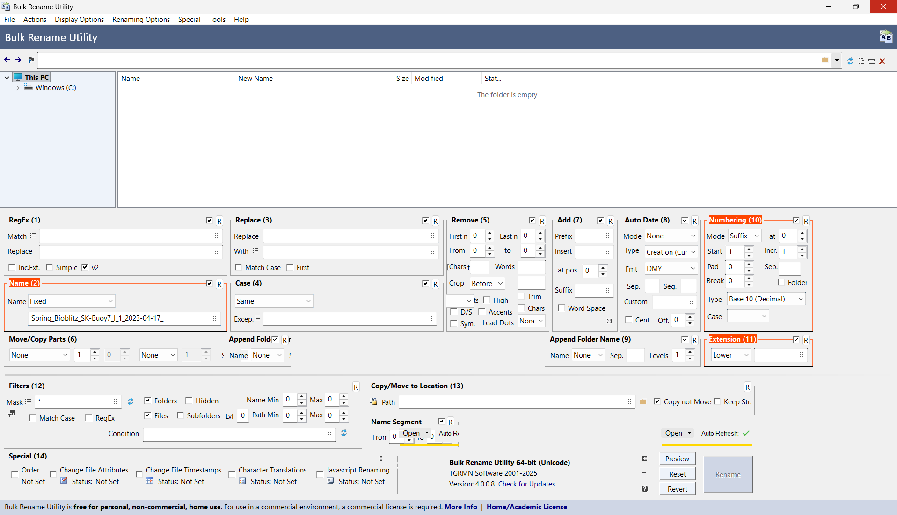

# Bulk Rename Utility
To rename files to have sequential numbers and lowercase file extensions, you can use [Bulk Rename Utility](https://www.bulkrenameutility.co.uk/). This guide was written by Guy.

## Step 1: Select your files
1. Open the software and navigate to your folder using the navigation tree on the left.
2. Highlight the files you want to change (press ++ctrl+a++ to select all files in that folder).

## Step 2: Set the New Name (Box No. 2)
1. In the _Name (2)_ box, change the dropdown menu to _Fixed_.
2. Type your desired name in the text field (e.g., `Experiment_Data_`).

!!! tip ""
    Always add an underscore or a space at the end of the name.

## Step 3: Add Sequential Numbering (Box No. 10)
To make the numbers automatically appear after your text.

1. In the _Numbering (10)_ box, set the _Mode_ to _Suffix_.

## Step 4: Format the Extension (Box No. 11)
To ensure all file extensions (like `.JPG` or `.PDF`) are converted to lowercase (`.jpg` or `.pdf`).

1. In the _Extension (11)_ box, change the dropdown menu to _Lower_.

## Step 5: Review and Apply
1. Look at the _New Name_ column (the orange text). Verify that the name, numbers, and extensions look correct.
2. Click the large _Rename_ button at the bottom right corner.
3. Confirm the action in the pop-up window.

