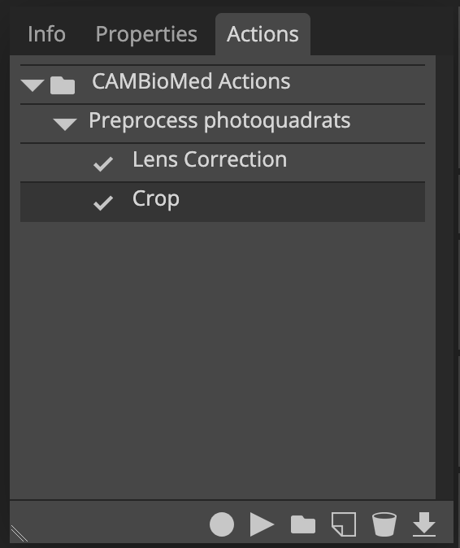
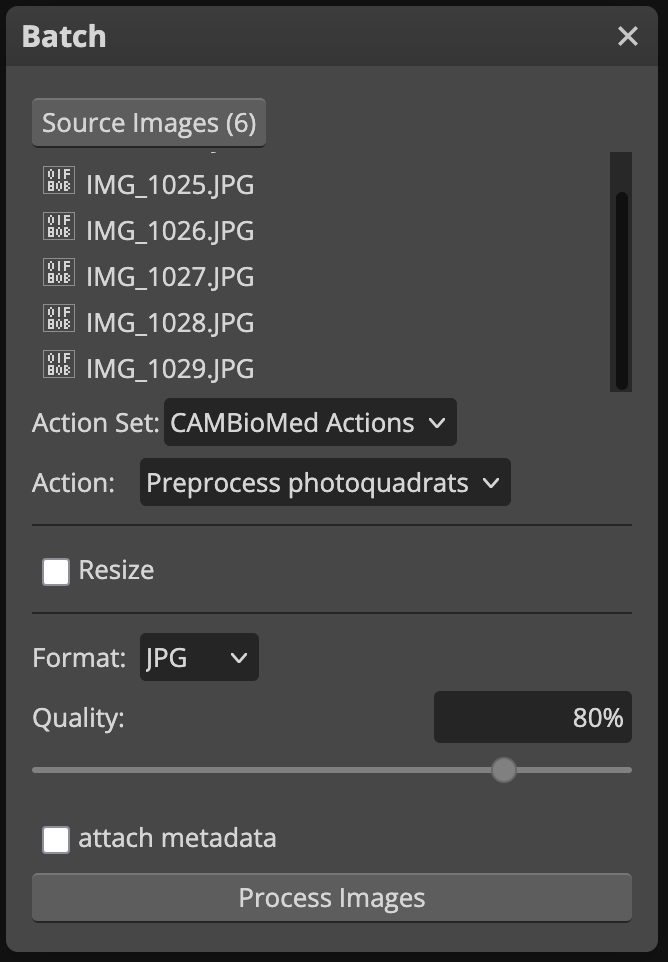

# Batch processing in Photopea

[Photopea](https://www.photopea.com/) can be used to do cropping, lens correction, color correction, among other tasks.
You can record these actions on a single photo, and then repeat the actions on all photos in a folder automatically (batch processing).

## Preparation
Ensure all the relevant photos are in the same folder.

Open the [Photopea](https://www.photopea.com/) website.

## Start recording an action
1.  Open one of the photos in Photopea (e.g., by dragging it from the file manager to the website).
2.  Go to the menu _Window_, _Actions_ to open the Actions window.
3.  Click the _:material-folder: New set_ button. Rename the new set (e.g., `CAMBioMed Actions`).
4.  Click the _:material-note-outline: New action_ button. Rename the new action in this set (e.g., `Preprocess photoquadrats`).
5.  Click the _:material-record: Record_ button to start recording.

!!! note ""
    You can stop and resume recording the action at any time using the buttons at the bottom of the Actions window.

{ width="400" }

## Perform actions
Now perform the actions to this photo that you want to repeat on other photos. See these pages for more information:

- [Lens correction](./lens-correction.md)
- [Color correcttion](./color-correction.md)
- [Square cropping](./square-cropping.md)
- [Perspective cropping](./perspective-cropping.md)

!!! note ""
    In contrast to Photoshop, it is not needed to perform a final _Save_ action in Photopea.

## Stop recording
1.  Press the _:material-stop: Stop_ button in the Actions window to stop recording.

## Apply to batch of photos
1.  Go to the menu _File_, _Automate_, _Batch..._.
2.  Click _Source Images_ and browse to the images to process.
3.  Under _Action Set_ pick the set you created.
4.  Under _Action_ pick the action you created.
5.  Set the Format to `JPG` and quality to `80%` or more.

        

6.  Click _Process Images_ to start processing.

!!! warning ""
    This may take a while, and you may not see progress until it is done.
    Photopea will fail to respond, and your browser might slow down.

7.  A ZIP archive with the processed images will be downloaded automatically.

