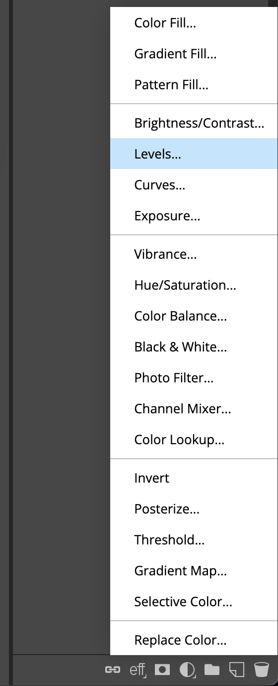
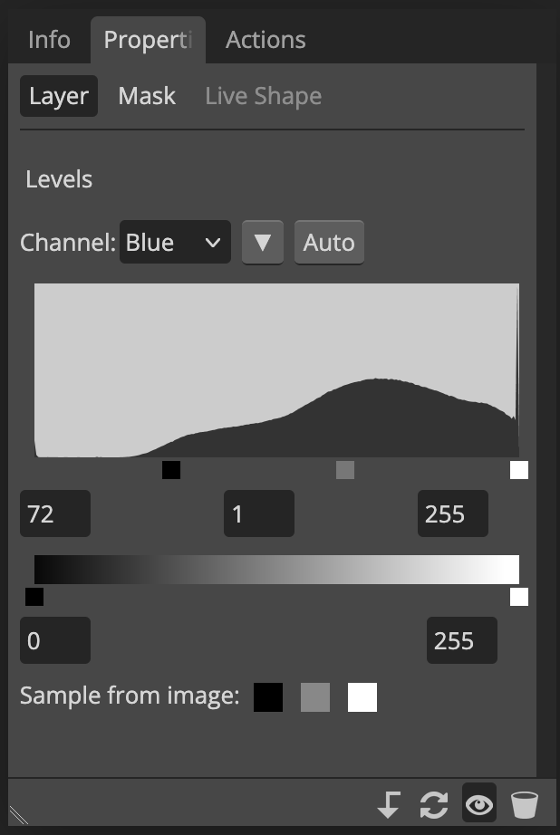

# Color correction in Photopea
As one of the first preprocessing steps, you'd want to color correct the photo. Benthic photos have a blue hue on them, and correcting the colors will make it easier to identify species.

In [Photopea](https://www.photopea.com/):

1.  Select the Main photo layer in the _Layers_ window.
2.  Click the _:material-circle-half-full: New Adjustment Layer_ menu button below the layers, and click _Levels..._.

    { width="150" }

!!! note ""
    We will correct the levels of each channel, in order: blue, then green, and finally red.
    The blue channel is the most saturated, and the red channel is the most lost.

4.  Set the levels for the blue_ channel:
    1.  Select the Channel: `Blue`.
    2.  Drag the black square below the histogram rightward until it meets the start of the histogram.
    3.  Drag the white square below the histogram leftward until it meets the end of the histogram (or leave it at the end if it's already there).

    { width="300" }

5.  Repeat the above steps for the _green_ channel.
6.  Repeat the above steps for the _red_ channel. The red channel's histogram will be leaning to the left, so you probably have to mostly move the white square to meet the tail end of the histogram.

!!! tip ""
    You can adjust the levels at any time by selecting the adjustment layer we created, and going to the _Properties_ window.

