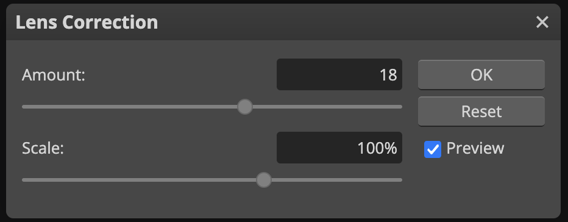

# Lens correction in Photopea
Before cropping a photo, you might want to perform lens correction. Especially if a fisheye lens was used, the straight lines in the photo might be deformed. This would emphasize the center of the photo much more than was actually the case in-situ.

In [Photopea](https://www.photopea.com/):

1.  Go to menu _Filter_, _Lens Correction..._.
2.  Move the _Amount_ slider until the lines in the photo are straight again.
3.  Confirm by clicking _OK_.

{ width="400" }

!!! tip ""
    Toggle the _Preview_ checkbox to see the photo with and without the lens correction.
    