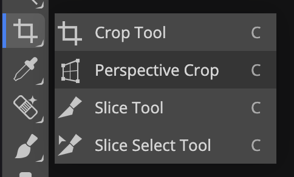

# Perspective cropping in Photopea
As one of the final preprocessing steps, you'd want to crop the photo such that it only has the relevant contents of the photoquadrat, removing the quadrat itself and anything outside it. You'd typically do this as the last step of preprocessing, after [color correction](./color-correction.md) and [lens correction](./lens-correction.md).

This page describes _perspective cropping_, which is the most accurate. Another way to crop is [square cropping](./square-cropping.md).

In [Photopea](https://www.photopea.com/):

1.  Click and hold the _:material-crop: Crop_ tool in the toolbar to select the _Perspective crop_ tool.

    { width="200" }

2.  Drag the four corners into the image until the highlighted region is inside the photoquadrat.
3.  Click the _:material-check-bold:_ button in the toolbar at the top to confirm and apply the crop.

