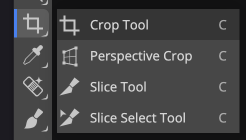

# Square cropping in Photopea
As one of the final preprocessing steps, you'd want to crop the photo such that it only has the relevant contents of the photoquadrat, removing the quadrat itself and anything outside it. You'd typically do this as the last step of preprocessing, after [color correction](./color-correction.md) and [lens correction](./lens-correction.md).

This page describes _square cropping_, which is the easiest. A more accurate way to crop is [perspective cropping](./perspective-cropping.md).

In [Photopea](https://www.photopea.com/):

1.  Select the _:material-crop: Crop_ tool in the toolbar.

    { width="200" }

2.  Drag the four sides into the image until the highlighted region is approximately inside the photoquadrat.

    { width="400" }

3.  Click the _:material-check-bold:_ button in the toolbar at the top to confirm and apply the crop.
