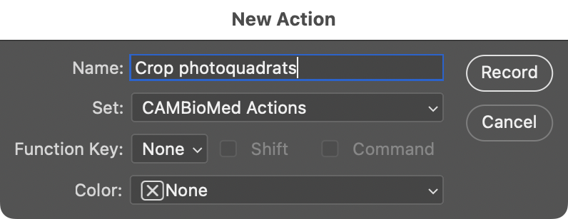
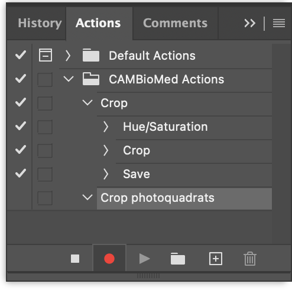
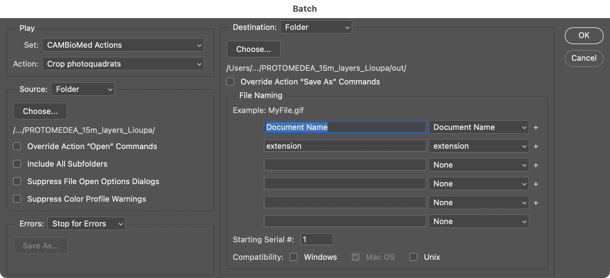

# Batch processing in Photoshop

Photoshop can be used to do cropping, lens correction, color correction, among other tasks.
You can record these actions on a single photo, and then repeat the actions on all photos in a folder automatically (batch processing).

## Preparation
Ensure all the relevant photos are in the same folder.

## Start recording
1.  Open one of the photos in Photoshop.
2.  Go to the menu _Window_, _Actions_ top open the Actions window.
3.  Click the _:material-folder: New set_ button and create a new set (e.g., `CAMBioMed Actions`).
4.  Click the _:material-plus-box: New action_ button and enter the information for a new action in this set (e.g., `Crop photoquadrats`).

    { width="400" }

5.  Click the _Record_ button to save the action and start recording.

!!! note ""
    You can stop and resume recording the action at any time using the buttons at the bottom of the Actions window.

{ width="400" }

## Perform actions
Now perform the actions to this photo that you want to repeat on other photos. See these pages for more information:

- [Lens correction](./lens-correction.md)
- [Color correcttion](./color-correction.md)
- [Square cropping](./square-cropping.md)
- [Perspective cropping](./perspective-cropping.md)

## Save action
Perform and record a final _Save As_ action.

## Stop recording
1.  Press the Stop button in the Actions window to stop recording.

## Apply to batch of photos
1.  Go to the menu _File_, _Automate_, _Batch..._.
2.  Under _Play_ pick the set and action you created.
3.  Under _Source_, choose _Folder_ and click the _Choose..._ button. Select the folder with the photos to process.
4.  At _Destination_, also choose _Folder_ and click the _Choose..._ button. Select an (empty) folder where you want to save the photos to process.

    !!! tip ""
        Leave the other settings as their default. See the screenshot.

        

5.  Click _OK_ to start processing. This may take a while, and you may not see progress until it is done.

