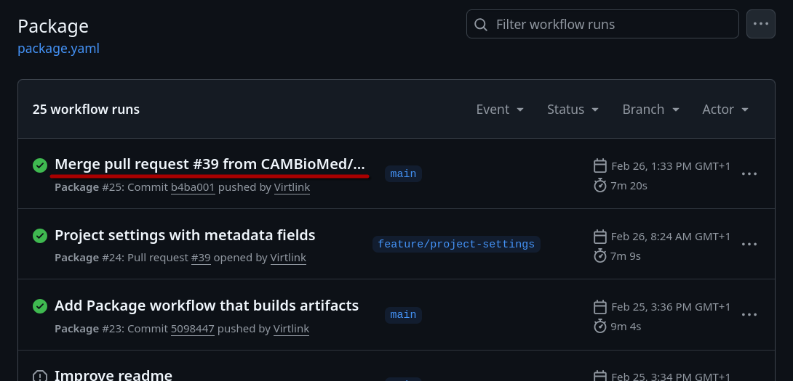
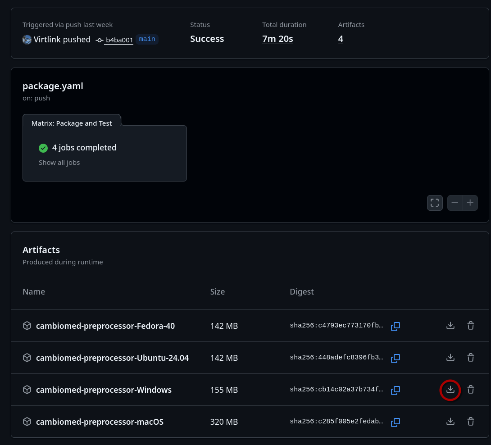

# CAMBioMed Preprocessor
CAMBioMed Preprocessor is the application created by Daniel Pelsmaeker for the CAMBioMed project.

## Download and Installation
Download the latest nightly (unstable) version:

1.  Go to [this page](https://github.com/CAMBioMed/preprocessor/actions/workflows/package.yaml).
2.  Click the latest successful workflow run, e.g., 'Merge pull request ...'.

    { width="300" }

3.  At the bottom you'll see a list of artifacts. Download the appropriate artifact for your system, one of:

    - Windows (`cambiomed-preprocessor-Windows.zip`)
    - MacOS (`cambiomed-preprocessor-macOS.zip`)
    - Ubuntu (`cambiomed-preprocessor-Ubuntu-24.04.zip`)
    - Fedora (`cambiomed-preprocessor-Fedora-40.zip`)

    { width="300" }

## Implementation
The application is open source, it's source code is available online:

[:simple-github: Source Code](https://github.com/CAMBioMed/preprocessor){ .md-button }

