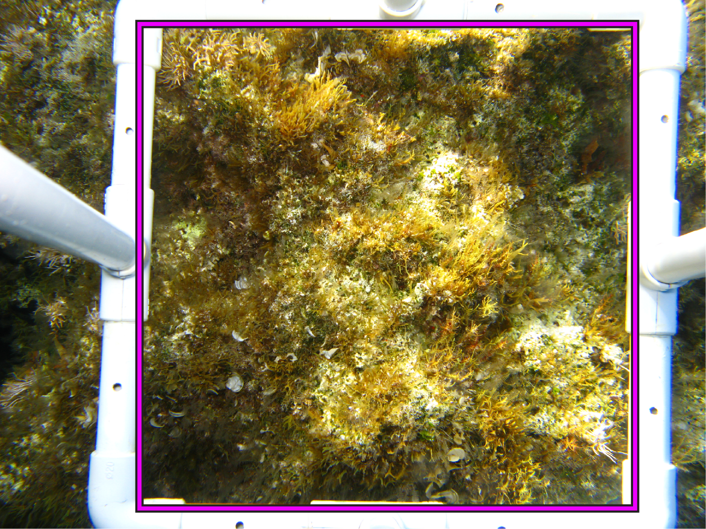
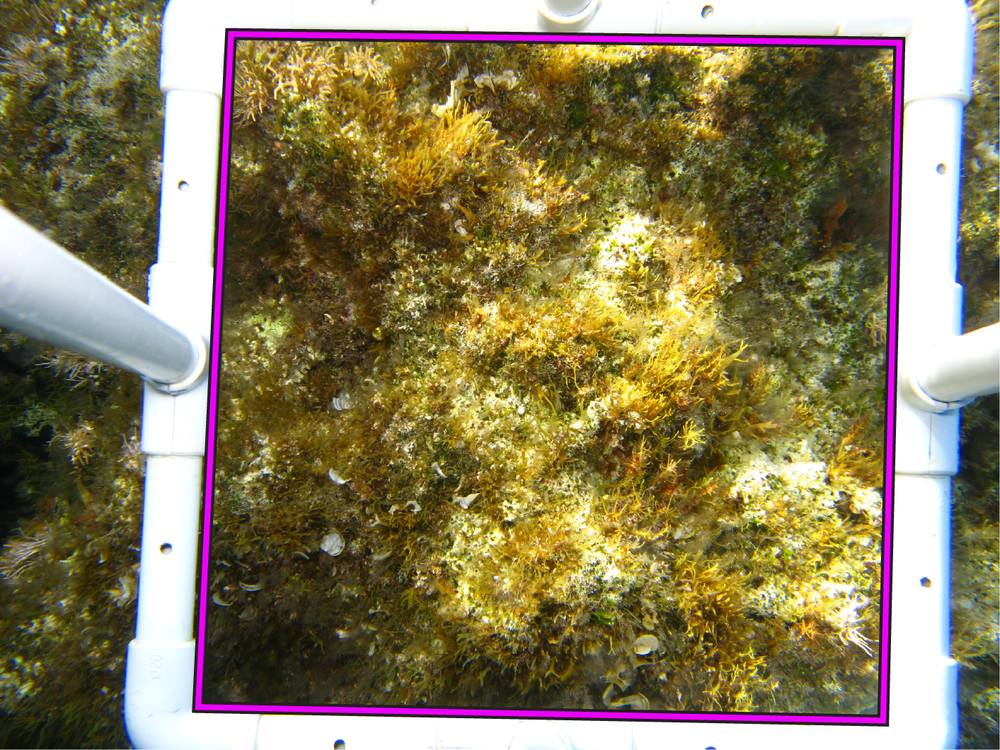

# Preprocessing methodology

## Crop
We want to crop the images to remove as much of the quadrat as possible.

<figure markdown="span">
  { width="300" }
  <figcaption>A square crop of the photo quadrat.</figcaption>
</figure><figure markdown="span">
  { width="300" }
  <figcaption>A perspective crop of the photo quadrat.</figcaption>
</figure>

