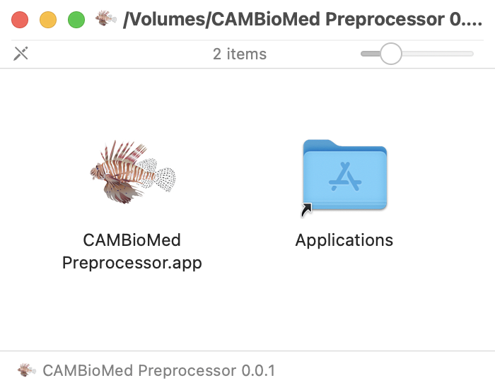
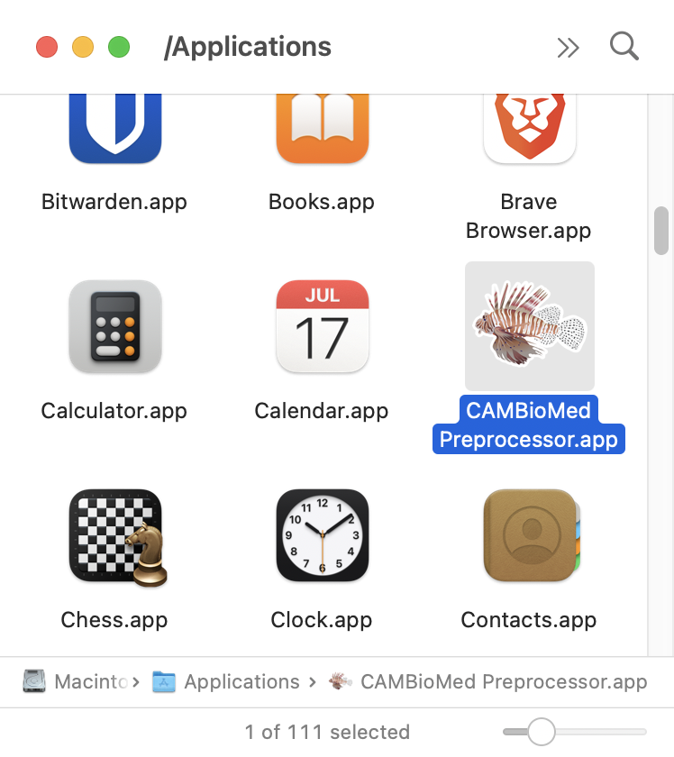
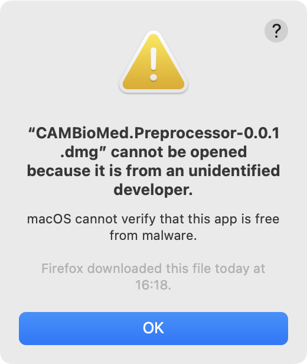

# Preprocessor installation on MacOS

## Download

1.  Go to [the project's latest Releases](https://github.com/CAMBioMed/preprocessor/releases/latest).
2.  Under _Assets_ download the DMG (installer) for CAMBioMed Preprocessor, e.g., 
`CAMBioMed.Preprocessor.dmg`

## Install

1.  Go to the terminal and `cd` to the directory with the downloaded MSI-file.
2.  Enter the following command, adjusting the filename to be the downloaded file:

    ```shell
    xattr -rc CAMBioMed.Preprocessor.msi
    ```

3.  Open the downloaded DMG-file. A window appears.

    { width="400" }

4.  Drag the _CAMBioMed Preprocessor.app_ application to the _Applications_ folder.


## Start
Find the application in the Applications-folder.

{ width="400" }


## Troubleshooting
### MacOS cannot verify that this app is free from malware
If you see this dialog, perform steps 1 and 2 above.

{ width="300" }
