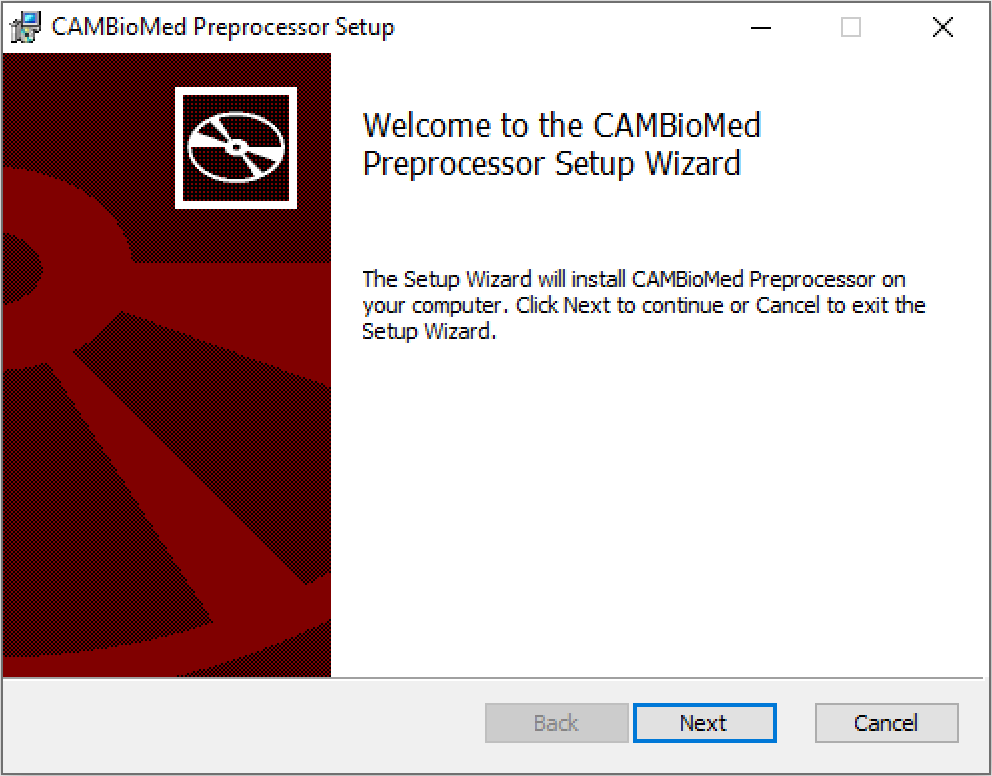
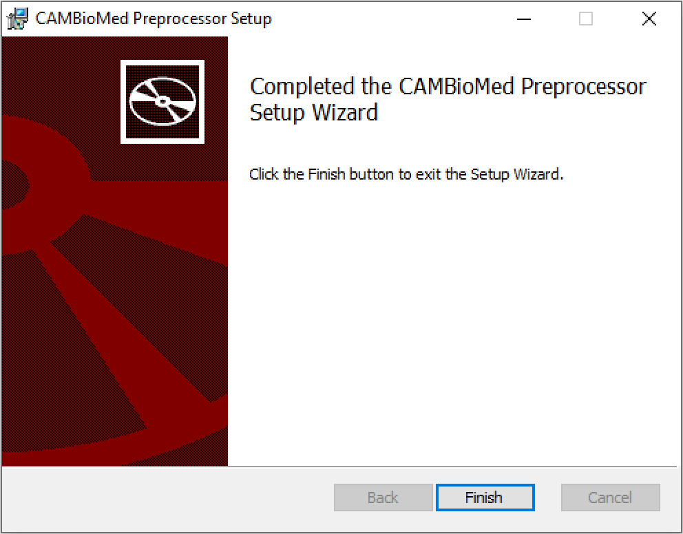
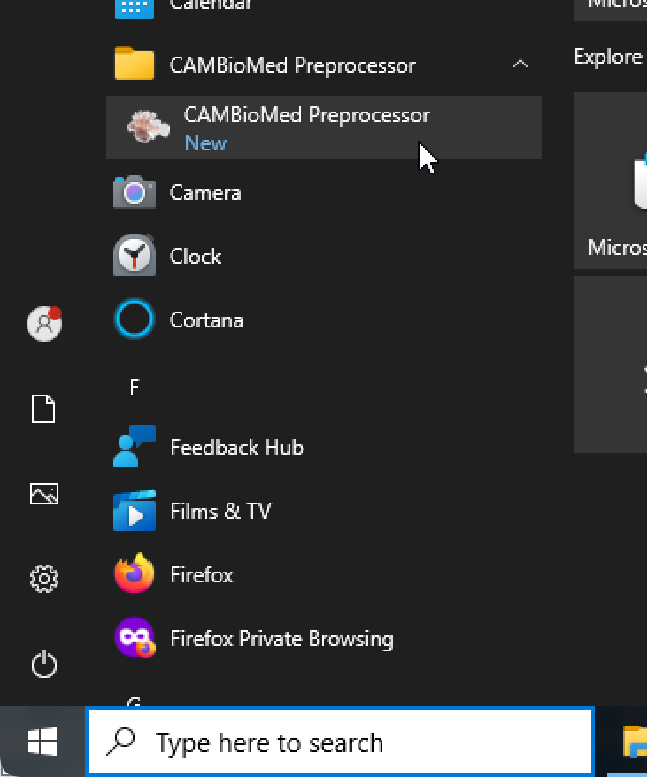

# Preprocessor installation on Windows

## Download

1.  Go to [the project's latest Releases](https://github.com/CAMBioMed/preprocessor/releases/latest).
2.  Under _Assets_ download the MSI (installer) for CAMBioMed Preprocessor, e.g., 
`CAMBioMed.Preprocessor.msi`

## Install

1.  Open the downloaded MSI-file.
2.  A window appears where Microsoft pretends it's protecting you.

    { width="400" }

3.  Click _More info_.

    { width="400" }

4.  Click _Run anyway_.

5.  Go through the installation steps.

    { width="400" }

6.  Wait for the installation to finish, then click _Finish_.

    { width="400" }

## Start
Find the application in the Start-menu.

{ width="400" }

